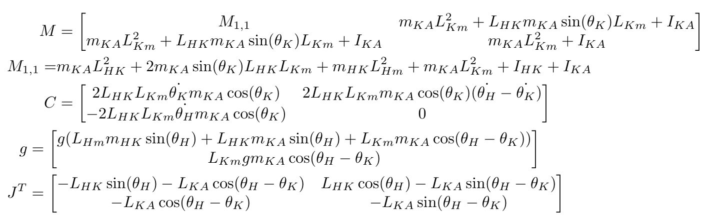

# Robotic-and-Control

<!--  -->

## Contents

| Title                                                                                      | Description                                                                                     |
|--------------------------------------------------------------------------------------------|-------------------------------------------------------------------------------------------------|
| [Type-2 Generalized Fuzzy Hyperbolic (IT2-GFH)](#type-2-generalized-fuzzy-hyperbolic-it2-gfh) | Advanced fuzzy logic control system, including forward formula and update rule.                |
| [Kinematic Model of Nvidia Jetracer Pro AI](#kinematic-model-of-nvidia-jetracer-pro-ai)      | Kinematic model for path planning and control in Nvidia Jetracer Pro AI.                         |
| [Dynamic Model of Lower Limb Exoskeleton Rehabilitation Robot](#dynamic-model-of-lower-limb-exoskeleton-rehabilitation-robot) | Development of a dynamic model for lower limb exoskeleton rehabilitation.                        |
| [Exoskeleton Robot]([link](https://github.com/KianoushAqabakee/Robotic-and-Control/tree/main/Exoskeleton%20Robot))                                                      | Files related to the exoskeleton project.                                                        |
| [Nvidia Jetracer Pro Control/MPC-RBF Control]([link](https://github.com/KianoushAqabakee/Robotic-and-Control/tree/main/Nvidia%20Jetiracer%20Pro%20Control/MPC-RBF%20Control))   | Code for Nvidia Jetracer Pro AI control models.                                                  |
| [Sliding Mode Control Based on the IT2-GFHS](#sliding-mode-control-based-on-the-it2-gfhs)    | Sliding mode control implementations using the IT2-GFHS system.                                  |

## Type-2 Generalized Fuzzy Hyperbolic (IT2-GFH)

### Forward Formula

$y_{I T 2-G F H S}=W \psi$
$W=[\alpha, \underline{\beta}, \bar{\beta}]$
$\psi=\left[1, \tanh \left(\frac{K(u-d)}{\underline{\sigma}^2}\right), \tanh \left(\frac{K(u-d)}{\bar{\sigma}^2}\right)\right]$

### Update Rule

$E=\frac{1}{2}\left(y_{\text {actual }}-y_{I T 2-G F H S}\right)^2=\frac{1}{2} e^2$

$\Delta \mathrm{W} = e  \psi$

$\Delta \mathrm{d}=e\left[-\frac{\mathrm{K}}{\underline{\sigma}^2}\left(1-\tanh \left(\frac{K(u-d)}{\underline{\sigma}^2}\right)^2\right),\right.$

$\left.\qquad\qquad-\frac{\mathrm{K}}{\bar{\sigma}^2}\left(1-\tanh \left(\frac{K(u-d)}{\bar{\sigma}^2}\right)^2\right)\right]$

$\Delta \bar{\sigma}=-e\frac{\mathrm{K}(u-d)}{\bar{\sigma}^3}\left(1-\tanh \left(\frac{K(u-d)}{\bar{\sigma}^2}\right)^2\right)$

$\Delta \underline{\sigma}=-e\frac{\mathrm{K}(u-d)}{\underline{\sigma}^3}\left(1-\tanh \left(\frac{K(u-d)}{\underline{\sigma}^2}\right)^2\right)$

$\Delta \mathrm{K}=e\left[-\frac{(u-d)}{\underline{\sigma}^2}\left(1-\tanh \left(\frac{K(u-d)}{\underline{\sigma}^2}\right)^2\right),\right.$

$\left.\qquad\qquad-\frac{(u-d)}{\bar{\sigma}^2}\left(1-\tanh \left(\frac{K(u-d)}{\bar{\sigma}^2}\right)^2\right)\right]$

## Kinematic Model of Nvidia Jetracer Pro AI 

$ \dot{p}_x = V \cos (\psi + \beta) $
$ \dot{p}_y = V \sin (\psi + \beta) $
$ \dot{\psi} = \frac{V \cos (\beta)}{L_{xf} + L_{xr}} \left(\tan (\delta_f) - \tan (\delta_r)\right) $
$ \beta = \arctan \left(\frac{L_{xf} \tan (\delta_r) + L_{xr} \tan (\delta_f)}{L_{xf} + L_{xr}}\right) $

## Dynamic Model of Lower Limb Exoskeleton Rehabilitation Robot 

## Exoskeleton Robot

Contains files related to the exoskeleton project.

## Nvidia Jetracer Pro Control/MPC-RBF Control

Holds code for the Nvidia Jetracer Pro AI control models.

## Sliding Mode Control Based on the IT2-GFHS

Includes sliding mode control implementations using the IT2-GFHS system.

## Interval Type-2 Generalized Fuzzy Hyperbolic

A Jupyter notebook with detailed implementation and simulations.

## License

This repository is licensed under the GPL-3.0 License.

## Contributions

Contributions are welcome! Please create an issue or submit a pull request for any enhancements or bug fixes.

## Contact

For any questions or further information, feel free to contact the repository owner.

mail: kianoush.aqabakee@yahoo.com
