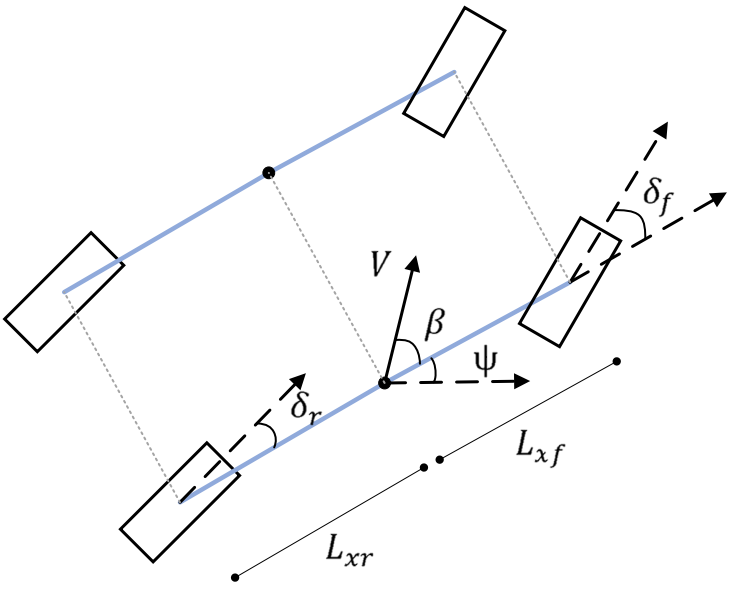

# Robotic-and-Control
#

## Kinematic Model of Nvidia Jetracer Pro AI 

$\dot{p}_x =V \cos (\psi+\beta)$
$\dot{p}_y =V \sin (\psi+\beta)$

$\dot{\psi} =\frac{V \cos (\beta)}{L_{x f}+L_{x r}}\left(\tan \left(\delta_f\right)-\tan \left(\delta_r\right)\right)$

$\beta =\arctan \left(\frac{L_{x f} \tan \left(\delta_r\right)+L_{x r} \tan \left(\delta_f\right)}{L_{x f}+L_{x r}}\right),$

## Dynamic Model of Lower Limb Exoskeleton Rehabilitation Robot 

$
\begin{gather*}
			\begin{aligned}
				M &= \begin{bmatrix}
					M_{1,1} & m_{KA} L_{Km}^2 + L_{HK} m_{KA} \sin(\theta_K) L_{Km} + I_{KA} \\
					m_{KA} L_{Km}^2 + L_{HK} m_{KA} \sin(\theta_K) L_{Km} + I_{KA} & m_{KA} L_{Km}^2 + I_{KA}
				\end{bmatrix} \\
				M_{1,1} = & m_{KA} L_{HK}^2 + 2 m_{KA} \sin(\theta_K) L_{HK} L_{Km} + m_{HK} L_{Hm}^2 + m_{KA} L_{Km}^2 + I_{HK} + I_{KA} \\
			%M_{1,2} = & \\
			%M_{2,1} = & \\
			%M_{2,2} = & \\
				C &= \begin{bmatrix}
					2 L_{HK} L_{Km} \dot{\theta_K} m_{KA} \cos(\theta_K) & 2 L_{HK} L_{Km} m_{KA} \cos(\theta_K) (\dot{\theta_H} - \dot{\theta_K}) \\
					-2 L_{HK} L_{Km} \dot{\theta_H} m_{KA} \cos(\theta_K) & 0
				\end{bmatrix}
			\end{aligned} \\
			\begin{aligned}
				g &= \begin{bmatrix}
					g (L_{Hm} m_{HK} \sin(\theta_H) + L_{HK} m_{KA} \sin(\theta_H) + L_{Km} m_{KA} \cos(\theta_H - \theta_K)) \\
					L_{Km} g m_{KA} \cos(\theta_H - \theta_K)
				\end{bmatrix} \\
				J^T &= \begin{bmatrix}
					- L_{HK}\sin(\theta_H) - L_{KA}\cos(\theta_H - \theta_K) & L_{HK}\cos(\theta_H) - L_{KA}\sin(\theta_H - \theta_K) \\
					- L_{KA}\cos(\theta_H - \theta_K) & - L_{KA}\sin(\theta_H - \theta_K)
				\end{bmatrix}
			\end{aligned}
		\end{gather*}
        $